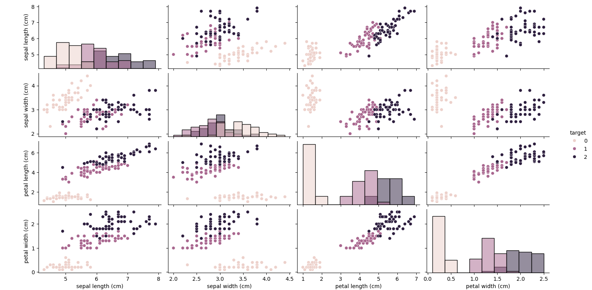

# Mini Data Science Projects

This repository contains two beginner-friendly projects demonstrating **Python**, **Machine Learning**, and **Time Series Forecasting** using real code and visualizations.

---

## Projects

### 1 Iris Classification Project
- **Goal:** Classify iris flowers into species using the Iris dataset.
- **Steps:**
  - Load the Iris dataset and convert it to a DataFrame.
  - Split into train/test sets and train a **Random Forest Classifier**.
  - Evaluate model performance and print accuracy and classification report.
- **Libraries:** `pandas`, `matplotlib`, `seaborn`, `scikit-learn`

**Sample Output:**

Accuracy: 1.0
Classification Report:
precision recall f1-score support
setosa 1.00 1.00 1.00 10
versicolor 1.00 1.00 1.00 9
virginica 1.00 1.00 1.00 11


**Visualization:**


---

### 2️ Sales Forecasting Project
- **Goal:** Forecast monthly sales using synthetic data (3 years).
- **Steps:**
  - Create sample sales data with trend and randomness.
  - Train **Holt-Winters Exponential Smoothing** model.
  - Forecast the next 6 months and visualize results.
- **Libraries:** `pandas`, `numpy`, `matplotlib`, `statsmodels`

**Sample Output:**
Forecasted sales for next 6 months:
2023-01-31 431.96
2023-02-28 435.41
2023-03-31 438.86
2023-04-30 442.31
2023-05-31 445.76
2023-06-30 449.22


**Visualization:**


---

## Installation
Install the required Python libraries:
```bash
pip install pandas matplotlib seaborn scikit-learn statsmodels
## How to Run
Run each project individually:
- python "Mini Data Science Project - Iris Class.py"
- python "Mini Time Series Project - Sales Forecast.py"

